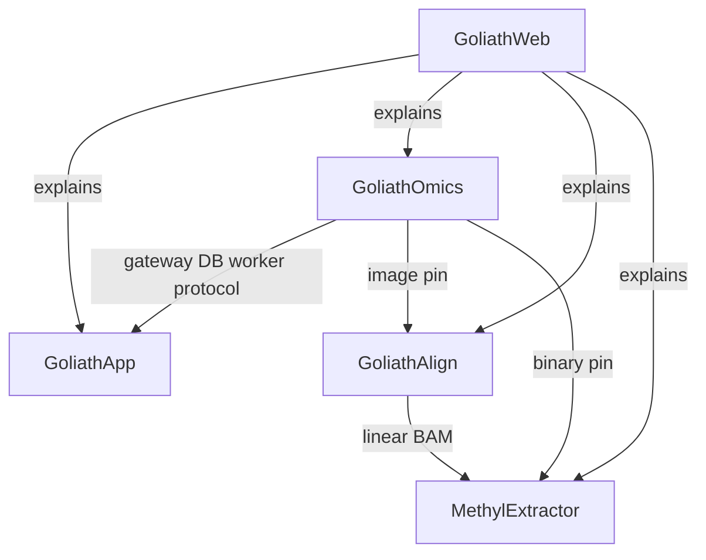

# Goliath workspace

Committed map of the live repositories. A short copy for the local checkout sits at the parent of these repos (`README.md` next to `GoliathApp/`). That parent directory is not a git repository.

GoliathWorkflow is deprecated. It is not a documented run path. It is removed after GoliathApp and GoliathOmics pass their integration test.

## Repositories

| Repo | Owns | Does not own |
|------|------|----------------|
| [GoliathApp](https://github.com/Goliath-Research/GoliathApp) | Meta, RBAC, `Meta.Objs`, portal UI objects, `wf` and `cfg` engine, gateway, shared claim/submit worker, schemas that bind custom entities to the engine | Methylation, diseases, science packages, aligners, extractors |
| [GoliathOmics](https://github.com/Goliath-Research/GoliathOmics) | Genomics product: science packages, DomainPrograms, profiles, analytes, `methyl_worker` handlers, science seeds and docs | Engine DDL, portal shell, claim protocol |
| [GoliathAlign](https://github.com/Goliath-Research/GoliathAlign) | Multiplatform Mojo aligner (CPU, CUDA, HIP): linear and pangenome paths. First consumer is GoliathOmics WGBS | Workflow engine, extraction from linear BAM |
| [MethylExtractor](https://github.com/Goliath-Research/MethylExtractor) | Focused MethylDackel fork: methylation calls from linear BAM to HDF5 | Alignment, portal, workflow engine |
| [GoliathWeb](https://github.com/Goliath-Research/GoliathWeb) | Public hub | Courses, omics portal, product source |

`methyl-*` stays the genomics CLI alias for one release cycle. `goliath-*` is the platform prefix. "Application pack" stays a GoliathOmics config-overlay term, not a name for GoliathApp.

## What left GoliathWorkflow

The deprecated repository mixed a generic platform with genomics. The split is:

- Platform (instances, RBAC, workflow engine, portal objects, entity-binding schemas) → GoliathApp
- Genomics, methylation, diseases, and algorithms → GoliathOmics
- Alignment → GoliathAlign
- Linear BAM methylation extraction → MethylExtractor
- Public explanation of the set → GoliathWeb

## Tool flow

FASTQ goes to GoliathAlign. A linear BAM then goes to MethylExtractor. WGBS pangenome methylation calls stay inside GoliathAlign (`MethylCall` / `MergeCpG`). GoliathOmics owns QC, studies, and algorithms. GoliathApp owns instances, RBAC, and the engine.

## Rename

| Former | Current | One-cycle alias |
|--------|---------|-----------------|
| Repository `mojo-align` | Local directory `GoliathAlign` | `gh repo rename GoliathAlign --repo Goliath-Research/mojo-align`, then the old URL redirects |
| `MOJO_ALIGN_*` | `GOLIATH_ALIGN_*` | `MOJO_ALIGN_*` still read, with a deprecation warning |
| `/opt/mojo-align` | `/opt/goliath-align` | Symlink `/opt/mojo-align` inside the image |

Unchanged: Mojo as the language; package directories `gpu-common/`, `fq2bam-meth/`, `giraffe/`, `methylgrapher/`, `numeric/`; CLI `methylGrapher`; image repository `goliath/methylgrapher` and tags `*-mojo-*`.

## Where to read

| Topic | Home |
|-------|------|
| Platform overview | [platform.md](platform.md) in this repo |
| Usage, theory, regulatory, research | GoliathOmics `docs/` |
| Aligner specs | GoliathAlign `fq2bam-meth/docs/`, `giraffe/docs/`, `methylgrapher/docs/` |
| Extraction QC contract | MethylExtractor `docs/extraction_qc_contract.md` |
| Public pages | GoliathWeb |

Older GoliathOmics chapters may still say MethylPipeline. That name means the genomics product now called GoliathOmics. Platform behavior is documented here.
